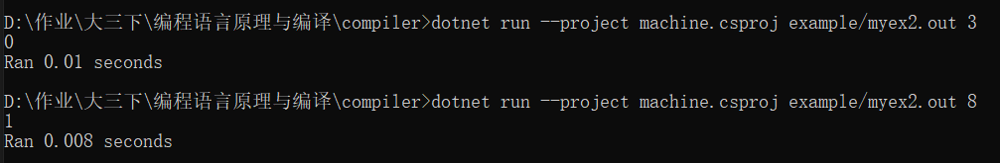

# **2021-22学年第2学期**

## **实 验 报 告**


-   课程名称: <u>编程语言原理与编译</u>
-   实验项目: <u>期末大作业</u>
-   专业班级: <u>计算1901</u>
-   学生学号: <u>31902106</u>
-   学生姓名: <u>王煜霖</u>
-   实验指导教师: <u>郭鸣</u>

---

## 1. 简介


编译原理大作业

---

## 2. 项目自评等级

---

|                     |                                    |
| ------------------ | ----- | --------------------------- |
| 功能               | 评分  | 备注                             |
| 注释 `//` `/* */` `(* *)`                        | ⭐⭐⭐⭐⭐ |                                  |
| 单引号`''`双引号`""`    |  ⭐⭐⭐⭐⭐     |                                  |
| 最大值max & 最小值min   |  ⭐⭐⭐⭐⭐   |
| 绝对值abs  |  ⭐⭐⭐ | 
| 自增自减 `i++`&`i--`&`++i`&`--i`  |  ⭐⭐⭐ | 
|  三元式         |  ⭐⭐     | 
|  switch case         |  ⭐⭐     | 
|  for / while / do while/ until       |  ⭐⭐    | 

---


## 3. 项目说明

---

**项目是基于已有的microc代码**

* 在microc的基础上添加：
  * 自增自减 `i++`&`i--`&`++i`&`--i` 
  * 单引号`''`双引号`""`  
  * 最大值max & 最小值min 
  * 绝对值abs 
  *  for / while / do while/ until  
  *  switch case  
* 在microc的基础上独立添加：
  * 注释的多样化
  * 三元式   

---
## 项目运行

  - **解释器**

     dotnet restore interpc.fsproj //可选

     dotnet clean interpc.fsproj  //可选

     **dotnet build -v n interpc.fsproj //构建，-v n查看详细生成过程**

     ./bin/Debug/net5.0/interpc.exe  测试的文件 参数

     dotnet run --project interpc.fsproj 测试的文件 参数

     dotnet run --project interpc.fsproj -g 测试的文件 参数 //显示token AST 等调试信息  

  -  **编译器：**

     dotnet restore microcc.fsproj

     dotnet clean microcc.fsproj

     **dotnet build microcc.fsproj //构建编译器**

     dotnet run --project microc.fsproj example/myex1.c 1测试的文件 //执行编译器

     ./bin/Debug/net6.0/microcc.exe 测试的文件 //直接执行

   - **Java虚拟机：**

     javac Machine.java

     java Machine 测试的文件（.out)  参数 

     java Machinetrace 测试的文件 参数 //可以查看栈
  
 ---

## 4. 解决技术要点说明


### 前端部分


##### 1. 修改注释的表示方式，添加(* *),在CLex.fsl中添加

```F#
rule Token = parse
  | "//"            { EndLineComment lexbuf; Token lexbuf }
  | "/*"            { Comment lexbuf; Token lexbuf }
  | "(*"            { Comment lexbuf; Token lexbuf }
```

##### 2. **最大值max & 最小值min**

1. Absyn.fs
```F#
  | Max of expr * expr               (* Max function                *)
  | Min of expr * expr               (* Min function                *)
  ```

2. CPar.fsy CLex.fsl

   添加关键词max,min，用于解析代码中的min和max为MIN、MAX

3. Interp.fs

   添加MIN、MAX指令


##### 3. **绝对值abs**

1. Absyn.fs
```F#
  | Abs of expr                      (* Abs function                *)
  ```

2. CPar.fsy CLex.fsl

   添加关键词abs，用于解析代码中的abs为Abs

3. Interp.fs

   添加Abs指令


##### 4. **自增自减`i++` `i--` `++i` `--i`**

1. Absyn.fs
```F#
  | NextInc of access                (*  x++                        *)
  | NextDec of access                (*  x--                        *)
  | PreInc of access                 (* 自增 ++x                    *)
  | PreDec of access                 (* 自减 --x                    *)
   ```

2. CPar.fsy CLex.fsl

   添加关键词`++` `--`，用于解析代码中的NextInc、NextDec、PreDec、PreInc

3. Interp.fs

   添加NextInc、NextDec、PreDec、PreInc指令


##### 5. 三元式

1. CPar.fsy CLex.fsl

  添加声明
   `  | Expr QUES Expr COLON Expr           { Prim3($1, $3, $5)}
`

  2. Interp.fs

   添加Prim3指令


​	

##### 6. for 循环

1. Absyn.fs
```F#
  | For of expr * expr * expr * stmt
  ```

2. CPar.fsy CLex.fsl

   添加关键词`FOR`，用于解析代码中的for为FOR

3. Interp.fs

   添加FOR指令


##### 7. switch-case

简介：类似于C语言的switch-case，当没有break时候，匹配到一个case后，执行该case的body，并且会往下执行所有case的body。没有匹配到case时，不会执行body，且向下寻找匹配的case


##### 8. do while/ until


## 5. 提交记录及分工

---

* 分工

  | 姓名   | 分工 |
  | ------ | ---- |
  | 王煜霖 | 全部 |

* 提交记录


---

## 6. 心得体会

---
​	​	​	​	​	编译原理这门课是我在本科期间遇到的最为抽象的课程，从编译器到解释器，再到java虚拟机，理解的过程充满了遗忘和痛苦，无数次的报错和难以纠错，让我对编译原理深感敬畏，这是最底层的计算机知识，虽然过程痛苦，但至少对底层知识有了一定的了解。
​	​	​	​	个人理解，一个程序代码进入前端的编译器，首先是通过词法分析器CLex进行翻译，然后再到语法分析器CPar进行进一步的分析，最后到解释器interp.c进行编译，词法分析器CLex与语法分析器CPar利用抽象语法树Absyn对抽象语法树的定义生成抽象语法树。
​	​	​	​	期间尝试了一下float、string、char类型的转换以及后端自定义类型MyType的编写和实验，结果均以失败告终，不免让人遗憾，深感那种牵一发动全身的无力感，我相信这段时光将是我未来所回忆的一段难忘的时光。对于计算机世界的探索，我还有很长的路要走啊。